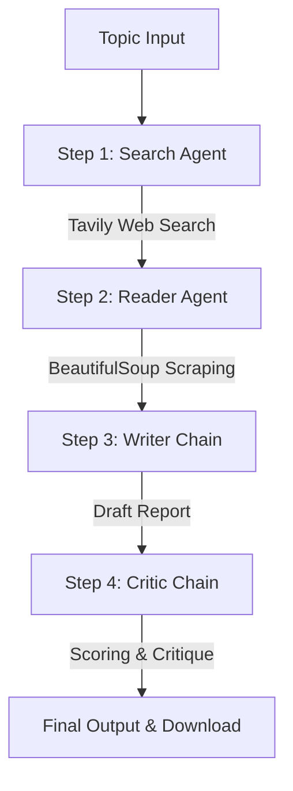

# 🔬 ResearchMind: Multi-Agent AI Research Assistant

ResearchMind is a collaborative multi-agent AI framework built with **LangChain** and **Streamlit** that automates the process of deep research, content curation, report generation, and critic review. By orchestrating a team of specialized agents and chains, ResearchMind fetches real-time web resources, scrapes detailed content, drafts comprehensive reports, and provides structured feedback.

---

## 🌟 Key Features

*   **Multi-Agent Coordination**: Employs multiple agents/chains working in a logical sequence to execute research.
*   **Real-time Web Searching**: Integrates with the Tavily Search API to gather the most recent and relevant sources.
*   **Smart Content Scraping**: Parses web resources, removes clutter (scripts, styles, headers, footers), and extracts rich knowledge.
*   **Structured Report Drafting**: Generates reports containing an Introduction, Key Findings (3-5 points), Conclusion, and bibliography sources.
*   **Double-Loop Critic Evaluation**: Evaluates reports using a dedicated critic chain that scores out of 10 and provides suggestions for improvement.
*   **Streamlined Interfaces**: Offers both a clean CLI interface and a gorgeous, responsive, glassmorphism dark-theme Streamlit dashboard.

---

## 🏗️ System Architecture & Workflow

The system progresses through a 4-step pipeline:



1.  **Search Agent** (`create_search_agent`): Uses Tavily to query the web for top reliable sources.
2.  **Reader Agent** (`create_scrape_agent`): Chooses the most promising URL and extracts the core text.
3.  **Writer Chain**: Combines findings from both steps and writes a detailed markdown report.
4.  **Critic Chain**: Evaluates formatting, facts, and clarity to provide actionable feedback.

---

## 📁 Repository Structure

*   [`app.py`](file:///Users/piyus_device/Desktop/multi%20agent%20system/app.py): Streamlit application code including custom premium styles, animations, status updates, and interactive components.
*   [`pipeline.py`](file:///Users/piyus_device/Desktop/multi%20agent%20system/pipeline.py): The core CLI pipeline logic for running the research process step-by-step in the terminal.
*   [`agents.py`](file:///Users/piyus_device/Desktop/multi%20agent%20system/agents.py): Defines the LangChain agents, chains, prompts, and output structures.
*   [`tool.py`](file:///Users/piyus_device/Desktop/multi%20agent%20system/tool.py): Custom tool wrappers for Tavily Search and BeautifulSoup-based scraping.
*   [`help.py`](file:///Users/piyus_device/Desktop/multi%20agent%20system/help.py): Auxiliary setup file utilizing alternative Google AI imports.
*   [`.env`](file:///Users/piyus_device/Desktop/multi%20agent%20system/.env): Configuration file housing API keys and model parameters.
*   [`requirements.txt`](file:///Users/piyus_device/Desktop/multi%20agent%20system/requirements.txt): Environment dependencies.

---

## ⚙️ Setup & Installation

### 1. Prerequisites
Ensure you have Python 3.8+ installed on your system.

### 2. Environment Configuration
Create or modify the `.env` file in the root directory:
```env
TAVILY_API_KEY=your_tavily_api_key
GOOGLE_API_KEY=your_google_gemini_api_key
MODEL=gemma-4-31b-it
```

### 3. Install Dependencies
Initialize your virtual environment and install the required modules:
```bash
# Optional: Setup virtual environment
python -m venv .venv
source .venv/bin/activate  # On Windows: .venv\Scripts\activate

# Install requirements
pip install -r requirements.txt
```

---

## 🚀 How to Run

### Run via Command Line (CLI)
To run the research pipeline directly inside your terminal:
```bash
python pipeline.py
```
*You will be prompted to enter a topic, and output stages will display in the console.*

### Run the Web Dashboard (Streamlit)
To start the interactive, premium web UI:
```bash
streamlit run app.py
```
Open the local URL generated (usually `http://localhost:8501`) in your browser to interact with the visual dashboard.

---

## 🛠️ Built With

*   [LangChain](https://github.com/langchain-ai/langchain) - LLM Orchestration Framework
*   [Streamlit](https://streamlit.io/) - Web UI Development
*   [Tavily](https://tavily.com/) - Search API optimized for LLMs
*   [BeautifulSoup4](https://www.crummy.com/software/BeautifulSoup/) - HTML Scraping and Parsing
